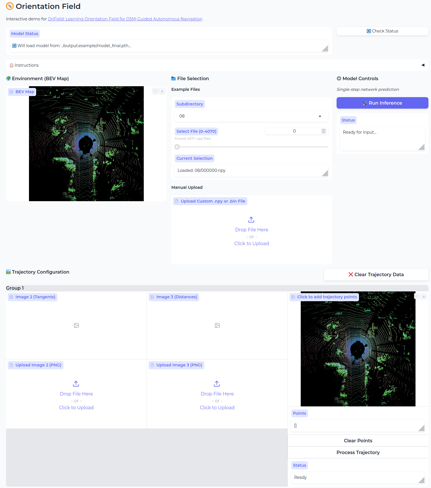

<div align="center">
  
# Learning Orientation Field for OSM-Guided Autonomous Navigation
# Abstract

OpenStreetMap (OSM) has gained popularity recently in autonomous navigation due to its public accessibility, lower maintenance costs, and broader geographical coverage. However, existing methods often struggle with noisy OSM data and incomplete sensor observations, leading to inaccuracies in trajectory planning. These challenges are particularly evident in complex driving scenarios, such as at intersections or facing occlusions. To address these challenges, we propose a robust and explainable two-stage framework to learn an Orientation Field (OrField) for robot navigation by integrating LiDAR scans and OSM routes. In the first stage, we introduce the novel representation, OrField, which can provide orientations for each grid on the map, reasoning jointly from noisy LiDAR scans and OSM routes. To generate a robust OrField, we train a deep neural network by encoding a versatile initial OrField and output an optimized OrField. Based on OrField, we propose two trajectory planners for OSM-guided robot navigation, called Field-RRT* and Field-Bezier, respectively, in the second stage by improving the Rapidly Exploring Random Tree (RRT) algorithm and Bezier curve to estimate the trajectories. Thanks to the robustness of OrField which captures both global and local information, Field-RRT* and Field-Bezier can generate accurate and reliable trajectories even in challenging conditions. We validate our approach through experiments on the SemanticKITTI dataset and our own campus dataset. The results demonstrate the effectiveness of our method, achieving superior performance in complex and noisy conditions. The code for network training and real-world deployment will be released.

<a href="https://"></a>
<a href="https://arxiv.org/abs/2503.18276"></a>
<a href="https://https://www.youtube.com/watch?v=nGqufhbP2NQ"></a>
<a href="https://"></a>
<a href="https://"></a>

</div>

[](https://youtu.be/nGqufhbP2NQ "Learning Orientation Field for OSM-Guided Autonomous Navigation")

## News
- **2025-03-18**: The paper was submitted to the Journal of Field Robotics. 
- **2025-08-14**: The paper was accepted to the Journal of Field Robotics. 
- **2026-02-23**: The source codes with pre-trained models and gradio app are released. 

# Orientation Field


> The implementation of the 'Orientation Field' pipeline for navigation.

This is the official implementation for **Learning Orientation Field for OSM-Guided Autonomous Navigation**. We provide the source code, pre-trained models, and instructions to reproduce our results.

## Table of Contents
* [To-Do Checklist](#to-do-checklist)
* [Installation](#installation)
* [Start Training](#how-to-train)
* [Run Inference](#how-to-inference)
* [Gradio App](#gradio-app)
* [Acknowledgements](#acknowledgements)
* [License](#license)

## To-Do Checklist

This is a list of features we plan to add or improvements we are working on.

- [x] Initial release of the source code and pre-trained models.
- [x] Elaberate `README.md` with instructions for training and inference.
- [x] Provide a Gradio app for demo use of OriField.
- [ ] Release ROS implementation.
- [ ] Add support for multi-GPU training.
- [ ] Create a Dockerfile for easier environment setup and deployment.
- [ ] Add more pre-trained models for different backbones.

## Installation

Follow these steps to set up the project environment. This project is tested on Ubuntu 18.04 with Python 3.9.7 and PyTorch 1.9.1.

1.  **Clone the repository:**
    ```bash
    git clone git@github.com:IMRL/OriField.git
    cd OriField
    ```

2.  **Create a virtual environment (recommended):**
    ```bash
    conda create -n OriField python=3.9
    conda activate OriField
    ```

3.  **Install dependencies:**
    Install Detectron2
    ```bash
    python -m pip install detectron2==0.6 -f https://dl.fbaipublicfiles.com/detectron2/wheels/cu111/torch1.9/index.html
    ```
    Other required packages are listed in `requirements.txt`.
    ```bash
    pip install -r requirements.txt
    ```

4.  **Install pybind:**
    Here is the c++ implementation of BVE projection and Field Planner.
    ```bash
    pip install -v -e .
    ```

## Start Training

```bash
python train_net.py
```

See `run.sh` or `run_um.sh` for specific settings.

## Run Inference

You can use the pre-trained model in this resposity to perform inference:

```bash
python export_model.py
```

See `run.sh` or `run_um.sh` for specific settings.

## Gradio App

```bash
python app.py --config-file ./output.example/config.yaml
```



## Acknowledgements

This project is built upon the excellent work of several other open-source projects. We are deeply grateful to their authors and contributors. Our implementation is based on the following repositories:

*   **[trajectory-prediction](https://github.com/Jiaolong/trajectory-prediction)**: We utilized their bev projection pipeline and adapted it for our project.

*   **[PMF](https://github.com/ICEORY/PMF)**: We utilized their point cloud data processing pipeline and adapted it for our project.

*   **[MaskFormer](https://github.com/facebookresearch/MaskFormer)**: We utilized their model training pipeline and adapted it for our project.

## License

This project is licensed under the MIT License. See the [LICENSE](LICENSE) file for more details.